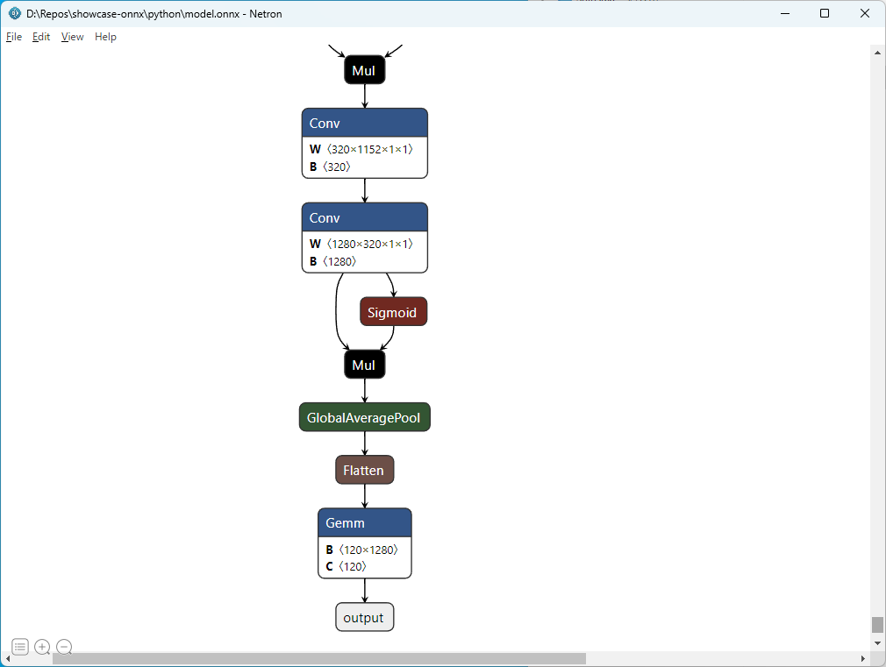
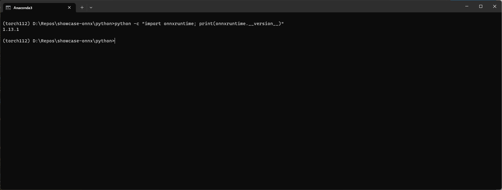
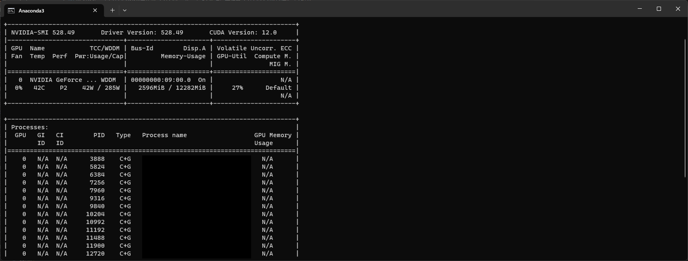
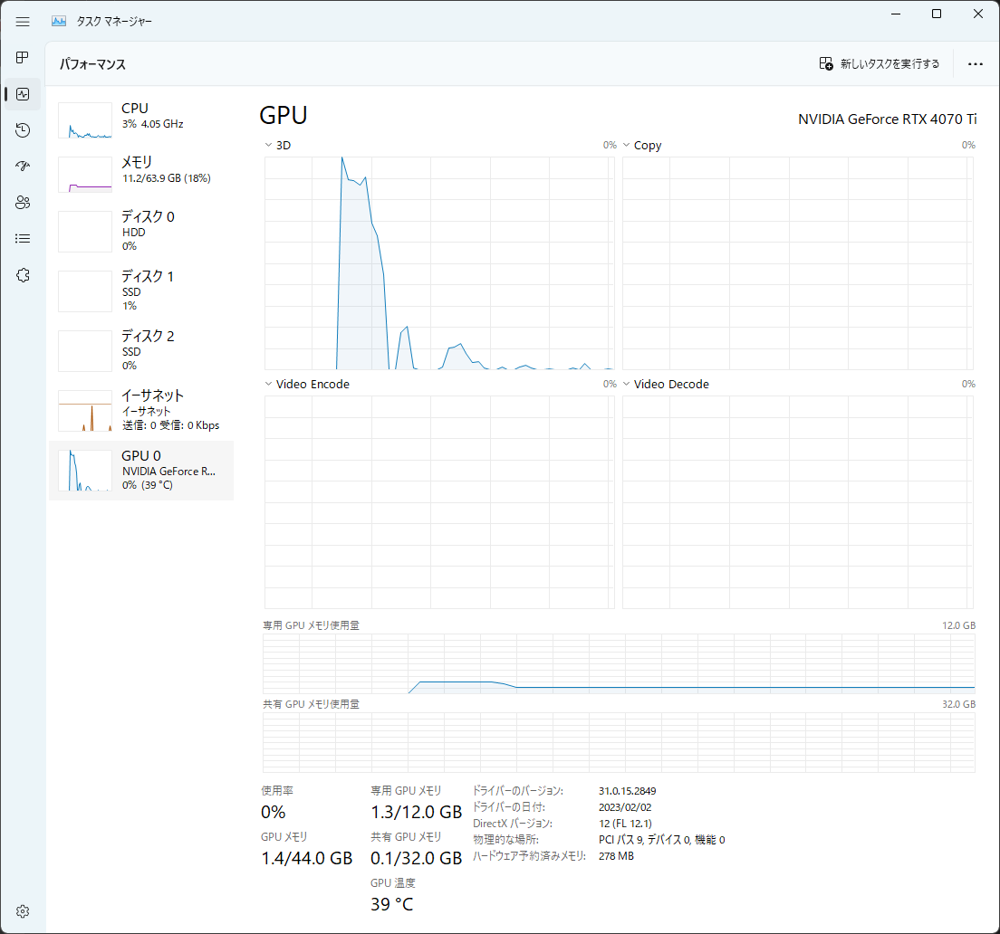

# ONNXサンプル

ONNX Runtimeを用いて推論環境を構築するためのサンプル環境.  

## 概要
デプロイやUnityなどと併せて使用したい場合にPythonとC#の間でモデルやり取りが必要なケースがある.  
このときONNX Runtimeを用いるのが可搬性や実現性が高いと考えており、  
雛型があると便利であることから用意しておく.  
  
**実現すること**
* PyTorchにてモデルを作成
* ONNX, Python環境で推論
* ONNX, C#環境で推論
  
## PyTorchによる学習モデル作成
学習方法は[showcase-optimizer](https://github.com/sinpcw/showcase-optimizer)などでも記載した通りのものを基本的にそのまま流用.  
変更点としてはpthやONNXによるモデル出力のコードを追加しており、  
学習後にmodel.pthおよびそのモデルから生成したmodel.onnxを出力する.  

**出力されたモデルの確認**  
ONNXモデルの確認は[NETRON](https://github.com/lutzroeder/netron)などのソフトウェアを用いて確認する.  
今回のモデル(timm_efficientnet_b0)は下記の通り.  
  
  
  
ONNXモデルのinput1, outputなどはこちらで定めている名前である.  
ONNXモデルを利用する上ではこの名前をもとに入力を与えるため、  
I/F名にはわかりやすい名前をつけておくことを推奨する.  
  
## Pythonによる推論環境構築
[ONNX Runtime - Install ONNX Runtime](https://onnxruntime.ai/docs/install/#python-installs)に従うと下記コマンドでインストールが可能.  
```bash
# CPU only
pip install onnx onnxruntime
# GPU
pip install onnx onnxruntime-gpu
```
  
GPU可否によって対応するライブラリを入れる必要があるがonnxruntime-gpuを入れたとしてもCPUExecuteProviderでCPU実行も可能.  
そのため、GPUが利用可能な環境では基本的にはonnxruntime-gpuを利用するで問題ないと思われる.  
  
### GPUで実行する場合
GPUExecutionProviderを利用する場合にはCUDAのバージョンには注意する.  
今回実験している検証環境のONNX Runtimeは 1.13.1 であった.  
対応するバージョンは CUDA 11.6 / cuDNN 8.5.0.96 (Windows) である.

**補足: CUDAバージョン違い時の挙動**  
現行の環境にインストールしてあるCUDAはCUDA 12.0 + cuDNN 8.8.0.121であったため、  
バージョンがあっていないが、CUDAExecutionProviderで実行するとGPUによる推論が動いた.  
ただし、無用なエラーを避けるため可能な限り指定versionを使用することを推奨する.  
またcuDNNをインストールしていない場合はエラーとなったのでインストールは必須と思われれる.  
 
[ONNX Runtime - CUDAExecutionProvider](https://onnxruntime.ai/docs/execution-providers/CUDA-ExecutionProvider.html)を参考に適切なバージョンを入れること.  
以下のコマンドにて環境にインストールされている onnxruntime のバージョンを確認できる.
```bash
python -c "import onnxruntime; print(onnxruntime.__version__)"
```
  
  

### 推論
推論実行コードとしては下記を用いている.  
学習時に合わせて作成したonnxファイルを読込み推論を実行する.  
```bash
infer.py
```
  
推論時の挙動確認としてタスクマネージャやnvidia-smiを監視するとGPUで正しく動作しているようである.  
  
  

## C#による推論環境構築

CSプロジェクトを作成する.  
CPUの設定はx64を指定する必要がある.  
  
必要なものをNuGetから取得してインストールする.  
推論のONNX Runtimeとしては下記のいずれかをインストールする.  
* Microsoft.ML.OnnxRuntime
* Microsoft.ML.OnnxRuntime.Gpu

.Gpuに関しては先のPythonと同じくGPUを用いる場合に指定することがあるならこちらを入れる.    
検証環境にてNuGetで取得したONNX Runtimeは 1.13.1 と先ほどと同様であったが、  
こちらはPythonの時と異なり厳密に指定されたバージョンを使用しないとエラーとなる.  
対応するバージョンは CUDA 11.6 / cuDNN 8.5.0.96 (Windows) である.  
これらをNVIDIAからダウンロードしてインストールとパスを通すこと.  
また、Windowsではcudnnをインストールしたディレクトリに zlibwapi.dll を合わせて配置する必要がある.  
この件についても[NVIDIAのリファレンス](https://docs.nvidia.com/deeplearning/cudnn/install-guide/index.html#install-zlib-windows)に記載がある.  
書かれている通り、Chromeでリンクをクリックしてダウンロードしようとすると、  
危険なファイルとして出てしまうため、右クリックからリンク先のファイルを保存を選択する.  

**推論時の注意点**  
今回はC#の画像の読み込みにはSystem.Drawing.Commonを用いている.  
ただしこれはWindowsサポートのみであるようだ.  
そのため、画像の読込みにはImageSharpやSkiaSharpを利用するほうが望ましいと思われる.  
ByteStreamとして取得できるのであれば、基本的には何を使っても問題はないように思う.  
ただし入力テンソルに合わせるためにリサイズする際には注意が必要.  
ライブラリなどによって挙動の差異があると思われるため、それ起因で推論結果が変わってしまうことがある.  

## 引用
* [ONNX Runtime](https://onnxruntime.ai/)  
* [NVIDIA - cuDNN Documentation](https://docs.nvidia.com/deeplearning/cudnn/install-guide/index.html)
* [NETRON](https://github.com/lutzroeder/netron)  
* [dog-breed-identification](https://www.kaggle.com/c/dog-breed-identification) : Dataset  
